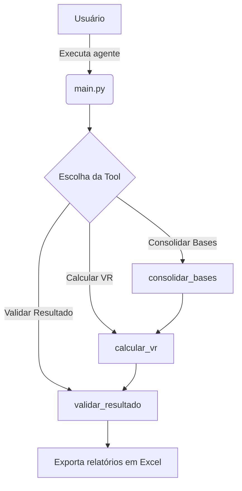

# Agente LangChain - Automação VR/VA

## 🚀 Objetivo
Automatizar o cálculo mensal de Vale Refeição, considerando admissões, desligamentos, férias, afastamentos e regras sindicais.

## 📂 Estrutura
- `main.py` → Ponto de entrada do agente.
- [`tools.py`](tools.py) → Implementação das ferramentas (cálculo, consolidação, validação).
- [`settings.py`](settings.py) → Configurações de paths.
- `requirements.txt` / `pyproject.toml` → Dependências.
- `data/` → Colocar aqui o .zip ou planilhas extraídas.

## 🛠️ Fluxo das Tools



- **consolidar_bases**: Carrega/extrai planilhas e prepara os dados.
- **calcular_vr**: Aplica as regras de cálculo do benefício.
- **validar_resultado**: Gera relatório explicativo por matrícula.

## ▶️ Instalação

### Usando pip

1. Crie um ambiente virtual:
   ```bash
   python -m venv .venv
   source .venv/bin/activate  # Linux/macOS
   .venv\Scripts\activate     # Windows
   ```
2. Instale as dependências:
   ```bash
   pip install -r requirements.txt
   ```

### Usando uv (mais rápido)

1. Instale o [uv](https://github.com/astral-sh/uv):
   ```bash
   pip install uv
   ```
2. Instale as dependências:
   ```bash
   uv pip install -r requirements.txt
   ```
   ou, para usar o `pyproject.toml`:
   ```bash
   uv pip install -r pyproject.toml
   ```

## ▶️ Execução

1. Certifique-se de que as planilhas ou o arquivo zip estão na pasta `data/`.
2. Configure variáveis de ambiente (opcional, `.env` já incluso para OpenAI).
3. Execute o agente:
   ```bash
   python main.py
   ```

O agente irá:
- Consolidar as bases de dados,
- Calcular os benefícios de Maio/2025,
- Gerar relatórios de resultado e validação em `data/`.

---

> **Obs:** O projeto suporta tanto instalação via pip tradicional quanto via [uv](https://github.com/astral-sh/uv) para ambientes mais rápidos e reprodutíveis.